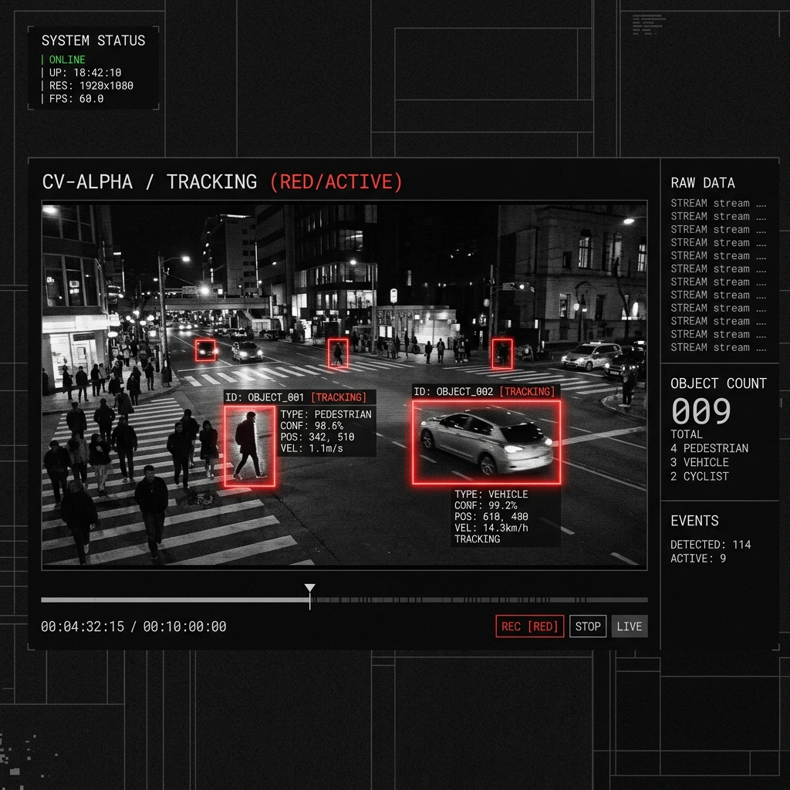

# BLOBSSS

BLOBSSS is a high-performance computer vision suite designed for real-time motion tracking and creative visualization. The system is engineered for 1:1 native-resolution fidelity, supporting professional creative coding and video analysis workflows with a focus on minimalist brutalist aesthetics.



## Technical Architecture

### Real-Time Tracking Engine
The tracking pipeline utilizes frame differencing and connected component labeling to identify motion regions in real-time.
- **Motion Masking**: Luminance-weighted per-pixel differentiation performed on a localized proxy canvas.
- **Labeling Algorithm**: Union-Find connected component labeling for efficient cluster detection.
- **Object Tracking**: Nearest-centroid assignment across frames for consistent identity persistence.
- **Subdivision System**: Support for NxN sub-box subdivision for high-density tracking within detected regions.

### Performance Optimization
- **Hardware-Accelerated Rendering**: Utilizes GPU-accelerated canvas rendering for low-latency previews.
- **Viewport-Aware Resolution**: Dynamic preview scaling ensures consistent frame rates at high source resolutions (4K+) while maintaining analytical accuracy.
- **Direct-to-MP4 Export**: Implements the WebCodecs API (VideoEncoder) and H.264 High Profile Level 5.2 for lossless-quality export without intermediate transcoding.
- **Backpressure Management**: Throttled capture loops and encoder queue monitoring prevent frame drops and system instability during high-bitrate recording.

### Render Specifications
The suite provides multiple visualization modes, each optimized for different analytical or aesthetic outcomes:
- **INVERT**: Geometric bounding boxes with difference-composite typography for high visibility.
- **ASCII**: High-detail density mapping utilizing a custom character ramp.
- **OUTLINE**: Minimalist stroke-based tracking with auxiliary fill opacity.
- **NET**: Centroid connectivity network utilizing quadratic bezier curves.
- **GHOST**: Temporal motion tails with decaying opacity and spatial history.
- **ELLIPSE**: Covariance-style visualization using concentric rings and centroid crosshairs.
- **PATH**: Monochrome background with persistent trajectory markers.

## System Controls
- **Toggle UI**: `CTRL + K`
- **Playback Control**: `SPACE` or canvas click
- **Snapshot**: PNG or SVG vector export at current frame resolution
- **Export**: Hardware-accelerated MP4 recording

## Implementation Details
- **Frontend**: Vite, React, TypeScript
- **Video Processing**: WebCodecs API, mp4-muxer
- **Motion Logic**: Custom Canvas2D/ImageData processing
- **Styling**: Vanilla CSS with Design Token architecture

## Deployment and Execution
To initialize the development environment:
```bash
npm install
npm run dev
```

The system requires a browser environment with WebCodecs support for full functionality.
