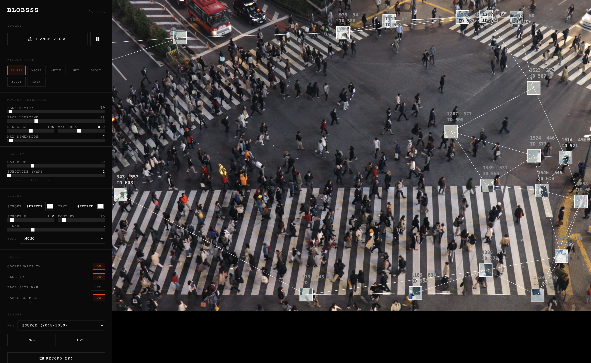
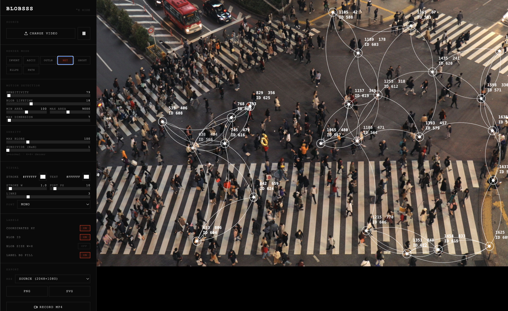

# BLOBSSS

BLOBSSS is a high-performance computer vision suite designed for real-time motion tracking and creative visualization. The system is engineered for 1:1 native-resolution fidelity, supporting professional creative coding and video analysis workflows with a focus on minimalist brutalist aesthetics.




## Technical Architecture

### Real-Time Tracking Engine
The tracking pipeline utilizes frame differencing and connected component labeling to identify motion regions in real-time.
- **Motion Masking**: Luminance-weighted per-pixel differentiation performed on a localized proxy canvas.
- **Labeling Algorithm**: Union-Find connected component labeling for efficient cluster detection.
- **Object Tracking**: Nearest-centroid assignment across frames for consistent identity persistence.
- **Subdivision System**: Support for NxN sub-box subdivision for high-density tracking within detected regions.

## Parameter Reference

### Motion Detection
- **SENSITIVITY**: Controls the pixel-level difference threshold required to trigger motion. Lower values are more sensitive to subtle movement.
- **BLOB LIFETIME**: The number of frames an object persists after motion has stopped. Useful for smoothing tracking jitter.
- **MIN / MAX AREA**: Filters detected regions by pixel area. Prevents noise from being tracked while allowing focus on specific object sizes.
- **MAX DIMENSION**: Limits the maximum width or height of a tracked region. Useful for ignoring large background shifts.

### Density
- **MAX BLOBS**: The maximum number of simultaneous objects to track and render.
- **SUBDIVIDE (NxN)**: Artificially increases tracking density by subdividing detected motion regions into a grid. 1x1 is standard tracking; 4x4 creates high-density point clouds.

### Visual Configuration
- **STROKE / TEXT COLOR**: Hex-based color selection for vector outlines and data labels.
- **STROKE W**: Width of the geometric outlines and connecting links.
- **FONT PX**: Size of the data labels in pixels.
- **LINKS**: Number of nearest-neighbor connections to draw between object centroids.
- **FONT**: Selection of typography (Monospace, Outfit, Serif, Sans).

### Label Options
- **COORDINATES XY**: Toggles the display of current centroid coordinates.
- **BLOB ID**: Toggles the persistent identification number of each object.
- **BLOB SIZE W×H**: Toggles the display of the bounding box dimensions.
- **LABEL BG PILL**: Toggles a background pill shape behind text for increased legibility.

## Performance Optimization
- **Hardware-Accelerated Rendering**: Utilizes GPU-accelerated canvas rendering for low-latency previews.
- **Viewport-Aware Resolution**: Dynamic preview scaling ensures consistent frame rates at high source resolutions (4K+) while maintaining analytical accuracy.
- **Direct-to-MP4 Export**: Implements the WebCodecs API (VideoEncoder) and H.264 High Profile Level 5.2 for lossless-quality export without intermediate transcoding.
- **Backpressure Management**: Throttled capture loops and encoder queue monitoring prevent frame drops and system instability during high-bitrate recording.

## System Controls
- **Toggle UI**: CTRL + K
- **Playback Control**: SPACE or canvas click
- **Snapshot**: PNG or SVG vector export at current frame resolution
- **Export**: Hardware-accelerated MP4 recording

## Implementation Details
- **Frontend**: Vite, React, TypeScript
- **Video Processing**: WebCodecs API, mp4-muxer
- **Motion Logic**: Custom Canvas2D/ImageData processing
- **Styling**: Vanilla CSS with Design Token architecture

## Deployment and Execution
```bash
npm install
npm run dev
```

The system requires a browser environment with WebCodecs support for full functionality.
